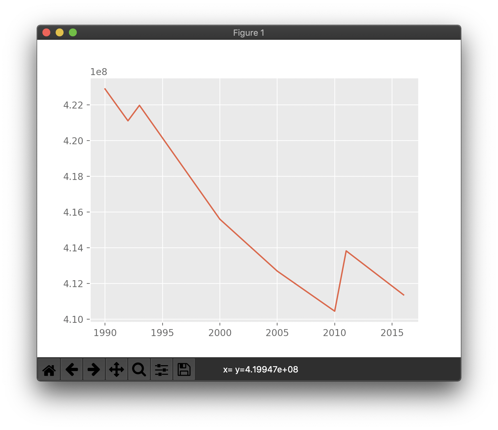
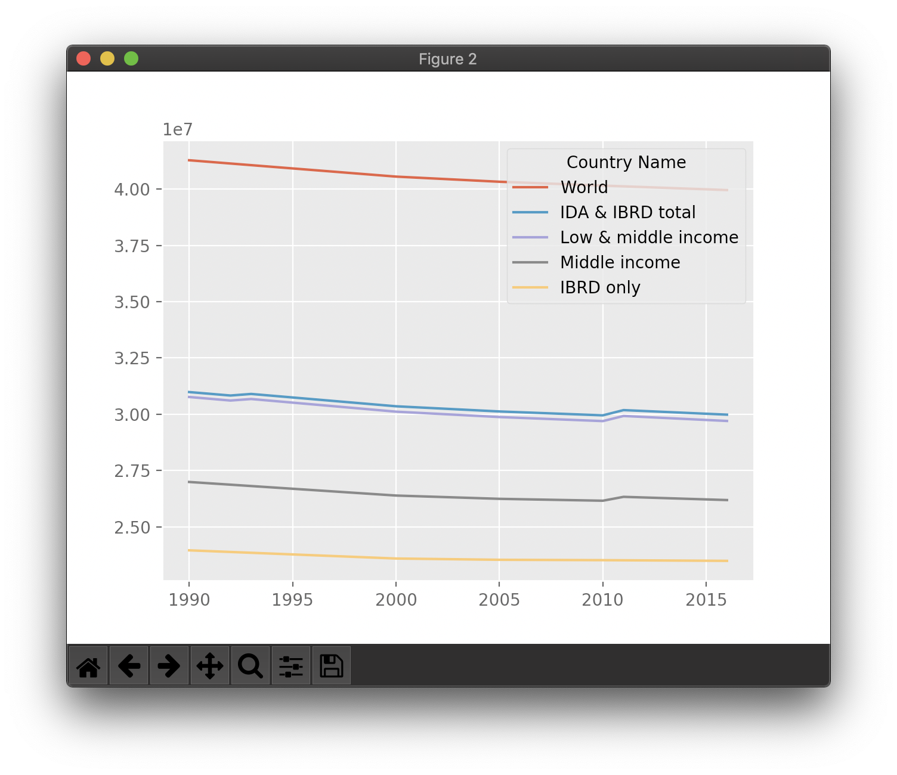

# Laboratory 1 

# Работа с данными

## Цель:
1. Изучить  библиотеки pandas и matplotlib, построение графиков в python, функции сортировки, работу с таблицами
2. Графически отобразить данные из excel-докусмента на графиках
***

## Итог:

### Тенденция по годам по всем странам

 
***

### Тенденция по топ-5 странам по годам.
 
