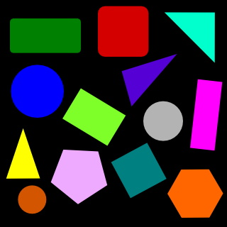
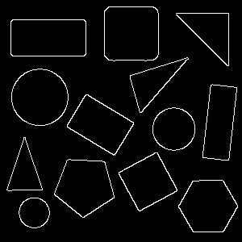
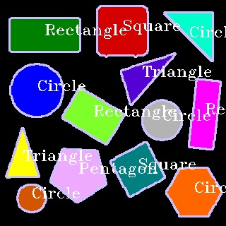

# Laboratory 2

## Цель работы: распознать и подписать фигуры

## Ход работы:
1. Красим изображение в серый цвет, пропускаем через фильтр блюра, после этих манипуляций получаем gray.jpg

2. С помощью оперетора Кэнни выделяем контуры фигур

3. Обводим контуры, считаем углы, находим центры фигур, затем подписываем

