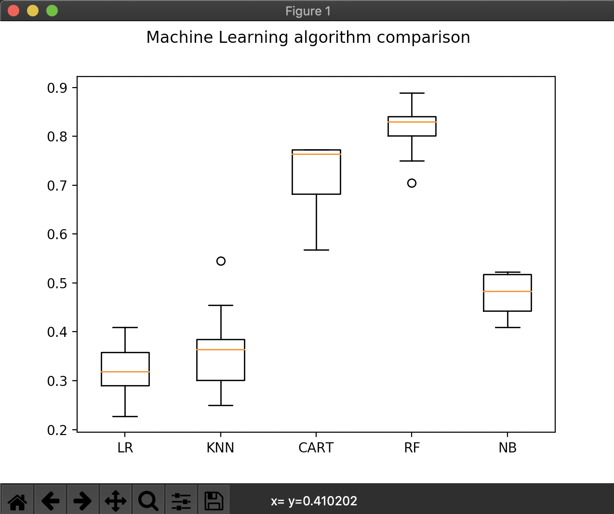
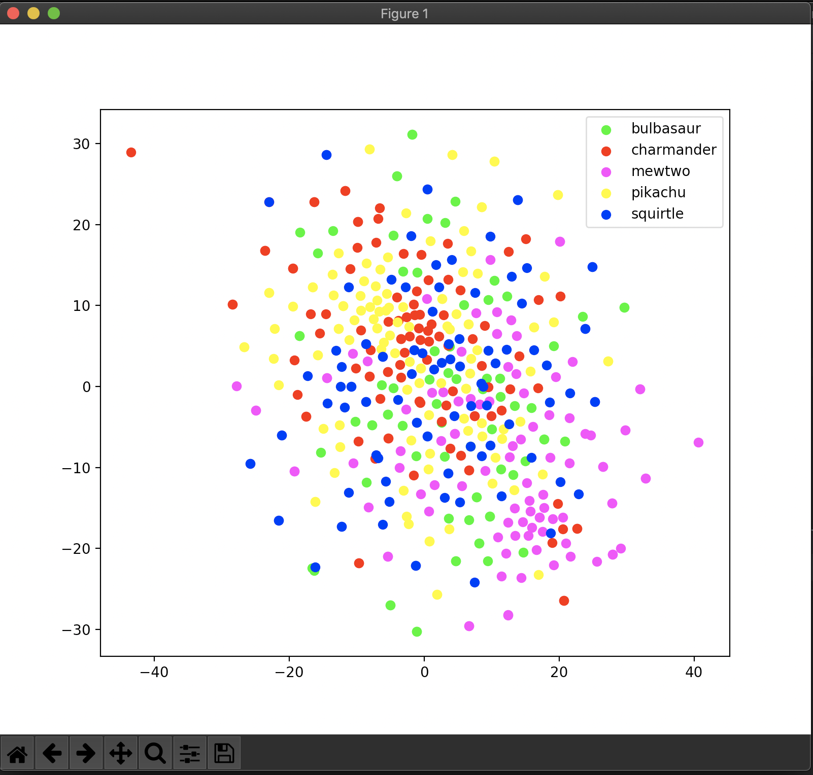

# Laboratory 3 and 4

## Lab_3

## Чтобы получить итоговый результат, нужно:

1. Запустить файл downloader.py, дождаться закачки архива и распределение по папкам его содержимого

2. Запустить файл prepare.py

3. Добавить в папку *test* картинки, по которым мы хотим идентифицировать тип покемона

3. Запустить файл train.py, дождаться обучения НС, после закрытия графика зайти в папку *result* и увидеть результат идентифицировать покемонов

## lab_4

1. Были добавлены новые фичи для лучшей кластеризации
2. Запускаем файл *prepare.py*, затем *tsne.py*
3. Получаем график

#### histogram + kaze + fast

### Больше скриншотов в папке ___screenshots/lab_3___
