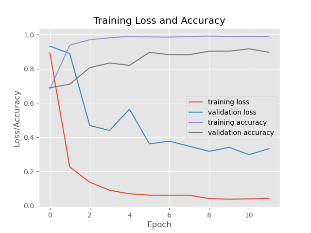
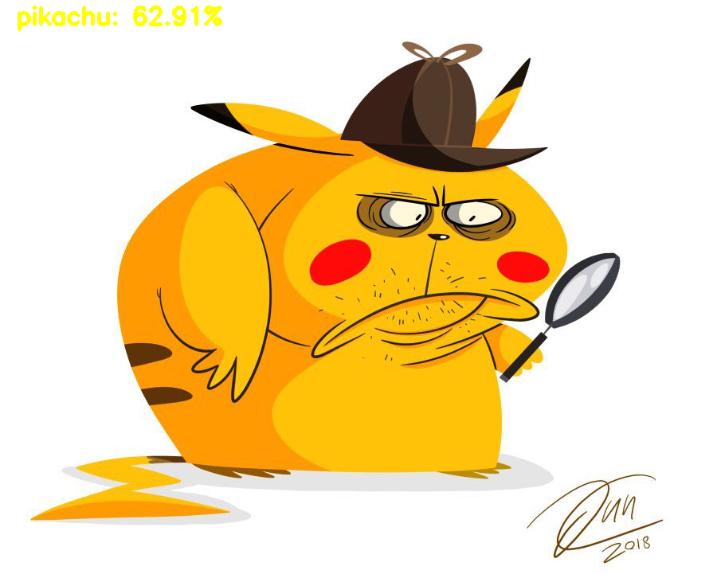

# Laboratory 5

1. Первым запускаем файл train.py
2. После обучение видим график

3. Затем запускаем predict.py => видим какой процент того или иного покемона находится в картинке

### Больше покемонов в папке ___data___
