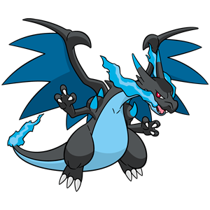
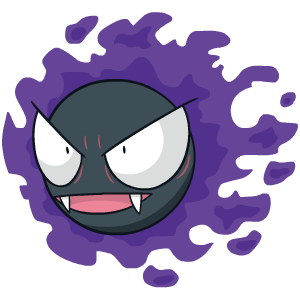
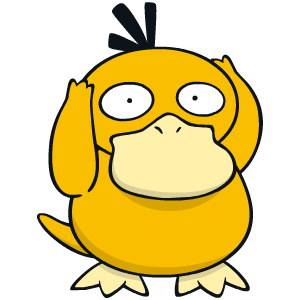
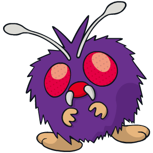
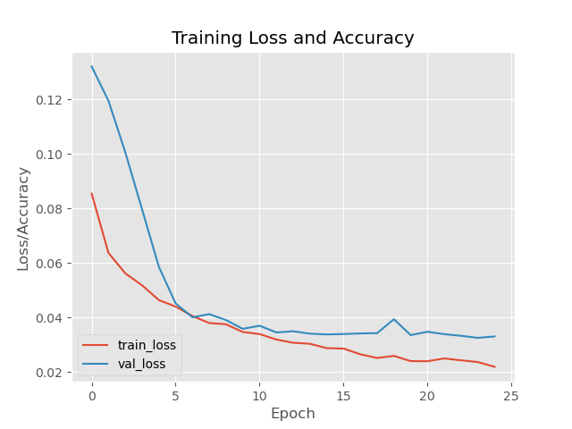

# Laboratory 6

## Ход работы:

1. Папка ___data/train___ содежит обучающую выборку

  

2. В папку ___data/test___ вставляются изображения, 

  

которые потом зашумляются и сохраняются в папку ___data/noise_test___

  

3. Обработанные нейросетью изображения склеиваются с исходными(зашумленныеми изображениями) и помещаются в папку
___data/result___ 

 

## Порядок запуска файлов программы
1. train.py -> predict.py

## График потерь модели

### Больше покемонов в папке ___data___

##
